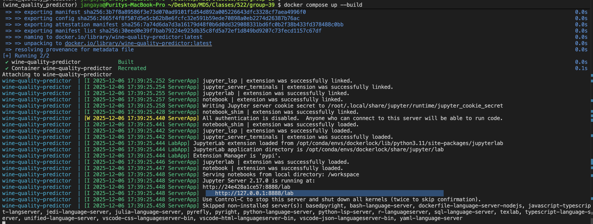

# Wine Quality Predictor

## Project Summary

This project predicts wine quality categories (Low, Medium, High) from physicochemical properties using a Random Forest classifier. Using the Wine Quality dataset from the UCI Machine Learning Repository containing 6,497 wine samples (1,599 red and 4,898 white), we analyze 11 chemical properties including alcohol content, acidity levels, and sulfur compounds to classify wine quality. The Random Forest model was chosen for its ability to capture non-linear relationships, provide interpretable feature importance rankings, and handle the class imbalance inherent in quality ratings. Our analysis identifies alcohol content, volatile acidity, and sulphates as the most influential factors in determining wine quality.

## Contributors

* **Junli Liu** ([@junliliu1](https://github.com/junliliu1))
* **Luis Alvarez** ([@luisalonso8](https://github.com/luisalonso8))
* **Purity Jangaya** ([@PurityJ](https://github.com/Purityj))
* **Jimmy Wang** ([@jimmy2026-V](https://github.com/jimmy2026-V))

## Dependencies

This project uses **Conda** for environment management. All the dependencies are listed in `environment.yml`.

Key packages include:

* Python 3.11
* pandas 2.1
* numpy 1.26
* matplotlib 3.8
* seaborn 0.13
* scikit-learn 1.3
* Jupyter / JupyterLab 4.0
* Quarto 1.4+
* click 8.0+

[Docker](https://www.docker.com/) is a key dependency. Find instructions on how to install and use it [here](https://www.docker.com/).

*Note: Lock files for different operating systems (macOS Intel, macOS ARM, Linux, Windows) are provided in `conda-lock.yml`. All dependencies are installed inside the Docker container. You do not need Python or any libraries installed locally.*

## Usage

Follow these steps to set up the environment and run the analysis:

### Setup

> If you are Windows or Mac, make sure Docker is running by clicking on the Docker app.

### 1. Clone this repository

Clone this repository and cd to the root of the repository using these commands: 

```bash
git clone https://github.com/junliliu1/wine_quality_predictor.git
cd wine_quality_predictor
```

### 2. Run the Analysis

1. Run the following command on the terminal(on your computer) to start docker container:

```bash
docker compose up
```

2. In the terminal, look for a URL that starts with 
`http://127.0.0.1:8888/lab` 
(for an example, see the highlighted text in the terminal below). 
Copy and paste that URL into your browser.



3. In JupyterLab, open a terminal by clicking File → New → Terminal in the top-left menu.

4. To run the whole analysis run the following commands:

```bash
python scripts/generate_figures.py --input-csv data/processed/wine_data_cleaned.csv \
    --out_dir="results"

quarto render reports/wine_quality_predictor_report.qmd --to html
quarto render reports/wine_quality_predictor_report.qmd --to pdf
```

5. To run the individual python scripts, on a terminal (in the docker jupyter lab) and run the following commands:

```bash
# 1. Download/Extract Data
python scripts/download_data.py \
    --output-dir data/raw

# 2. Clean/Transform Data
python scripts/clean_data.py \
    --red-wine data/raw/winequality-red.csv \
    --white-wine data/raw/winequality-white.csv \
    --output-path data/processed/wine_data_cleaned.csv

# 3. Exploratory Data Analysis

# 5. Model Fitting/Training
python scripts/04_train_wine_quality_classifier.py \
     --input-csv data/processed/wine_data_cleaned.csv \
     --output-model models/rf_wine_models.pkl

# 5. Model Evaluation

# 6. Render the final report
quarto render reports/wine_quality_predictor_report.qmd --to html
quarto render reports/wine_quality_predictor_report.qmd --to pdf
```

### Script Details

| Script | Description | Input | Output |
|--------|-------------|-------|--------|
| `01_download_data.py` | Download/Extract raw wine quality datasets | UCI URLs | `data/raw/*.csv` |
| `02_clean_data.py` | Clean, merge, and transform raw data | `data/raw/winequality-red.csv`, `data/raw/winequality-white.csv` | `data/processed/wine_data_cleaned.csv` |
| `03_preprocess_data.py` | (Optional) Split into train/test, encode labels, scale features | `data/processed/wine_data_cleaned.csv` | `data/processed/train_test_data.pkl` |
| `04_train_wine_quality_classifier.py` | Train Random Forest classifier | `data/processed/wine_data_cleaned.csv` | `models/rf_wine_models.pkl` |
| `05_evaluate_model.py` | Evaluate model (metrics, confusion matrix, feature importance) | `models/rf_wine_models.pkl`, `data/processed/wine_data_cleaned.csv` | `results/plots/*`, `results/metrics/*.json` |
| `generate_figures.py` | Generate all figures for the final report | `data/processed/wine_data_cleaned.csv` | `results/figures/*` |
| `reports/wine_quality_predictor_report.qmd` | Render final report | Processed data + generated figures | HTML + PDF files in `reports/` |

#### Clean up

For instructions on shutting down and cleaning up Docker containers, see [Developer Notes → Running the Analysis – Developer Options → Clean Up](#running-the-analysis-developer-options).

## Developer Notes

### Developer Dependencies

- `conda` (version 23.9.0 or higher)
- `conda-lock` (version 2.5.7 or higher)
- `docker`

### Adding a New Dependency

1. Add the dependency to the `environment.yml` file on a new branch.

2. Run `conda-lock lock --file environment.yml -p linux-64 -p osx-64 -p osx-arm64 -p win-64 -p linux-aarch64` to update the `conda-lock.yml` file.

3. **Rebuild the Docker container** to include the new dependency. See [Running the Analysis – Developer Options](#running-the-analysis-developer-options) for instructions on building and running the Docker container.

4. Push the changes to GitHub. A new Docker image will be built and pushed to Docker Hub automatically.  It will be tagged with the SHA for the commit that changed the file.

5. Update the `docker-compose.yml` file on your branch to use the new container image (make sure to update the tag specifically).

6. Send a pull request to merge the changes into the `main` branch.

#### Clean up

For instructions on shutting down and cleaning up Docker containers, see [Developer Notes → Running the Analysis – Developer Options → Clean Up](#running-the-analysis-developer-options).

### Running the Analysis (Developer Options)

After cloning the repository and cd to it on your local computer, the analysis can be run using either of these options depending on your workflow.

#### Option 1: Build the Docker Image Locally (Recommended for Development)

This is best option if you want to actively work on the project and potentially rebuild the environment.

```bash
docker compose up --build
```

This will build the Docker image and start the container.
Once the container is running, a link to access JupyterLab will be shown in the terminal. Look for a URL that starts with http://127.0.0.1:8888/lab. Copy and paste that URL into your browser.

Changes made in notebook are reflected locally in cloned repo. Commit and push changes to github for others to access.

#### Option 2: Pull a Prebuilt Image from DockerHub (Faster, Reproducible)

1. Pull the image from Dockerhub

```bash
docker pull junli73889/wine-quality-predictor:latest
```

2. Run the container

```bash
docker run -it -p 8888:8888 -v $(pwd):/workplace junli73889/wine-quality-predictor:latest
```

3. The container will start and provide a localhost URL. Look for a URL that starts with http://127.0.0.1:8888/lab. Copy and paste that URL into your browser.

*Note: In case of a docker container port conflict, e.g, if port 8888 is already in use, run docker on a different container as shown below:*

```bash
docker run -it -p 8889:8888 -v $(pwd):/workplace junli73889/wine-quality-predictor:latest
```

Alternatively, stop the container using port 8888:

```bash
docker ps          # to get the ID of the container using port 8888 as <container_id>
docker stop <container_id>
```

#### Clean Up

To shut down the container and clean up the resources,  type `Cntrl` + `C` in the terminal
where you launched the container, and then type `docker compose rm`

- If the container is running in the background, run this to list running containers: `docker ps`
- Find the container name or ID, then run this to stop the container: : `docker stop <container_id>`
- Stopping it does NOT delete it. To remove it, run this: `docker rm <container_id>`

## Project Structure

wine_quality_predictor/
│
├── data/
│   ├── raw/
│   └── processed/
│
├── docs/
│   └── index.html
│
├── img/
│
├── reports/
│   ├── wine_quality_predictor_report.qmd
│   ├── wine_quality_predictor_report.html
│   ├── wine_quality_predictor_report.pdf
│   └── references.bib
│
├── results/
│   ├── models/
│   ├── figures/
│   └── tables/
│
├── scripts/
│   ├── 01_download_data.py
│   ├── 02_clean_data.py
│   ├── 03_eda.py
│   ├── 04_train_wine_quality_classifier.py
│   └── 05_evaluate_model.py
│
├── environment.yml
├── conda-lock.yml
├── docker-compose.yml
├── Dockerfile
└── README.md

## Dataset

**Wine Quality Dataset** (Cortez et al., 2009)
- Source: [UCI Machine Learning Repository](https://archive.ics.uci.edu/ml/datasets/wine+quality)
- Features: 11 physicochemical properties
- Target: Quality score (3-9), categorized as Low (3-5), Medium (6-7), High (8-9)

## License

This project carries a dual license:

* **Software/Code**: The source code is licensed under the [MIT License](https://opensource.org/licenses/MIT).
* **Report/Analysis**: The narrative report and creative content are licensed under the [Creative Commons Attribution-NonCommercial-NoDerivatives 4.0 International (CC BY-NC-ND 4.0)](https://creativecommons.org/licenses/by-nc-nd/4.0/) License.

## References

Cortez, P., Cerdeira, A., Almeida, F., Matos, T., & Reis, J. (2009). Modeling wine preferences by data mining from physicochemical properties. Decision Support Systems, 47(4), 547-553.
